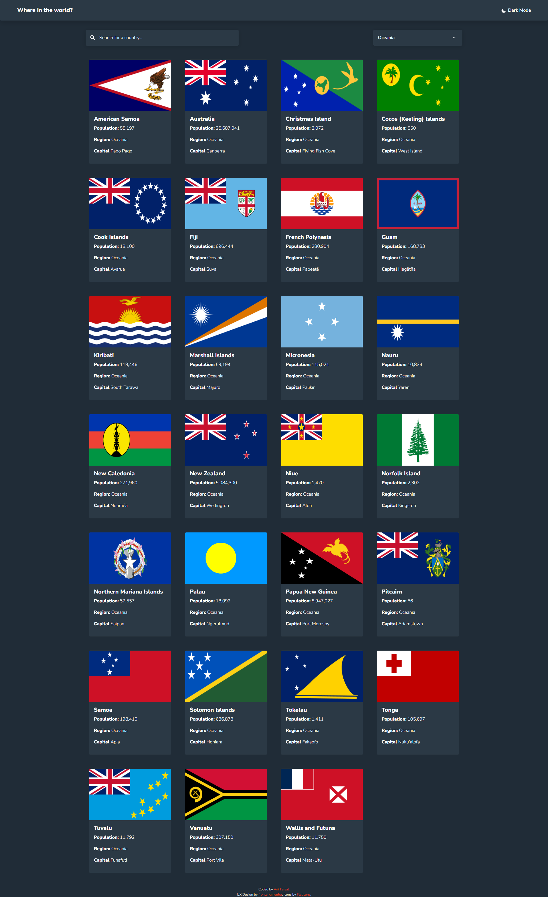

# Know Your Country 

The app helps you get basic information about a country, such as name, population, region, sub-region, capital, tld, currencies, languages, and borders. 

## Table of contents

- [Overview](#overview)
  - [Features](#features)
  - [Screenshot](#screenshot)
  - [Links](#links)
- [My process](#my-process)
  - [Built with](#built-with)
- [Author](#author)

## Overview

### Features

Users should be able to:

- See all countries around the world on the homepage
- Search for a country using an `input` field
- Filter countries by region
- Click on a country to see more detailed information on a separate page
- Click through to the border countries on the detail page
- Toggle the color scheme between light and dark mode 

### Screenshot

### Links

- Solution URL: [https://github.com/arifaisal123/frontend_projects/tree/main/frontend_challenges/REST_countries](https://github.com/arifaisal123/frontend_projects/tree/main/frontend_challenges/REST_countries)
- Live Site URL: [https://knowyourcountry.vercel.app](https://knowyourcountry.vercel.app)

## My process

### Built with

- CSS custom properties
- Mobile-first workflow
- Bootstrap
- jQuery
- Flask (Python)

## Author

- Website - [Arif Faisal](https://arifaisal123.github.io)
- Frontend Mentor - [@arifaisal123](https://www.frontendmentor.io/profile/arifaisal123)
- Twitter - [@faisalcodes123](https://www.twitter.com/faisalcodes123)
