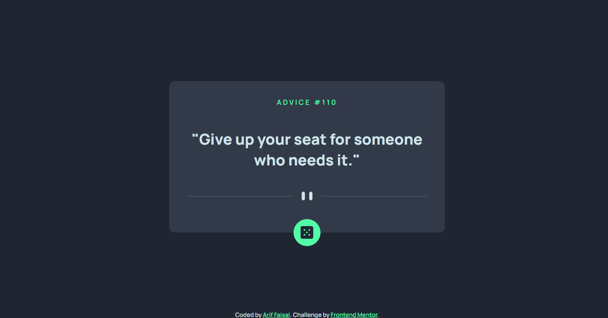

# Advice Generator App

This is a solution to the [Advice generator app challenge on Frontend Mentor](https://www.frontendmentor.io/challenges/advice-generator-app-QdUG-13db). The app generates random advices whenever user clicks the generator button. 

## Table of contents

- [Overview](#overview)
  - [The challenge](#the-challenge)
  - [Screenshot](#screenshot)
  - [Links](#links)
- [My process](#my-process)
  - [Built with](#built-with)
  - [What I learned](#what-i-learned)
  - [Continued development](#continued-development)
  - [Useful resources](#useful-resources)
- [Author](#author)
- [Disclaimer](#disclaimer)

## Overview

### The challenge

Users should be able to:

- View the optimal layout for the app depending on their device's screen size
- See hover states for all interactive elements on the page
- Generate a new piece of advice by clicking the dice icon

### Screenshot

### Links

- Solution URL: [Add solution URL here](https://your-solution-url.com)
- Live Site URL: [Add live site URL here](https://your-live-site-url.com)

## My process

### Built with

- Semantic HTML5 markup
- CSS custom properties
- Flexbox
- SCSS/ Sass
- Mobile-first workflow
- Vanilla JavaScript

## Author

- Website - [Arif Faisal](https://arifaisal123.github.io)
- Frontend Mentor - [@arifaisal123](https://www.frontendmentor.io/profile/arifaisal123)
- Twitter - [@faisalcodes123](https://www.twitter.com/faisalcodes123)

## Disclaimer

The app uses 3rd-part advice generator API [Advice Slip API](https://api.adviceslip.com). Advice is cached for 2 seconds, and therefore you must wait 2 seconds before generating a new advice.
