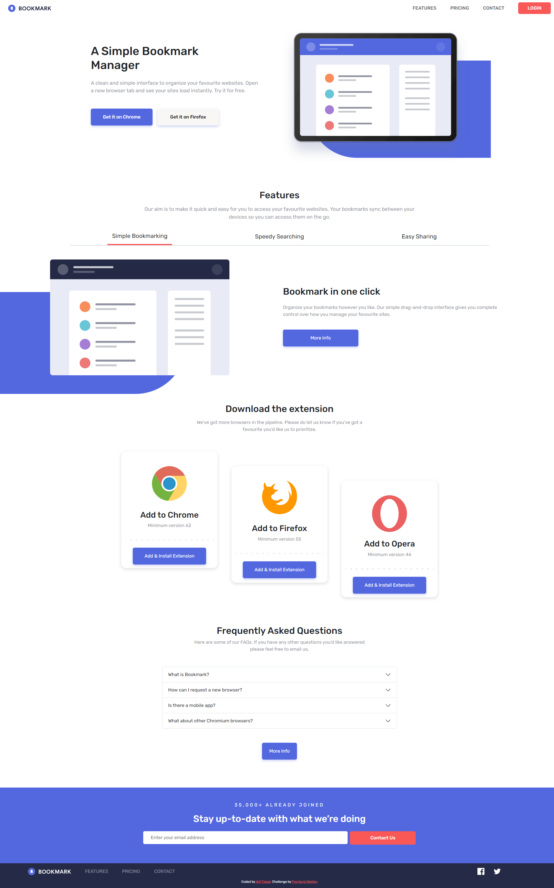

# Bookmark Landing Page

This is a simple landing page with responsive layout.

## Table of contents

- [Overview](#overview)
  - [Website features](#website-features)
  - [Screenshot](#screenshot)
  - [Links](#links)
- [My process](#my-process)
  - [Built with](#built-with)
- [Author](#author)

## Overview

### Website features

Users should be able to:

- View the optimal layout for the site depending on their device's screen size
- See hover states for all interactive elements on the page
- Receive an error message when the newsletter form is submitted if:
  - The input field is empty
  - The email address is not formatted correctly

### Screenshot

### Links

- Solution URL: [https://github.com/arifaisal123/frontend_projects/tree/main/frontend_challenges/bookmark_landingpage](https://github.com/arifaisal123/frontend_projects/tree/main/frontend_challenges/bookmark_landingpage)
- Live Site URL: [https://arifaisal123.github.io/frontend_projects/frontend_challenges/bookmark_landingpage](https://arifaisal123.github.io/frontend_projects/frontend_challenges/bookmark_landingpage)

## My process

### Built with

- Semantic HTML5 markup
- SCSS/ Sass
- Flexbox
- Bootstrap
- Mobile-first workflow
- Vanilla JS

## Author

- Website - [Arif Faisal](https://arifaisal123.github.io)
- Frontend Mentor - [@arifaisal123](https://www.frontendmentor.io/profile/arifaisal123)
- Twitter - [@faisalcodes123](https://www.twitter.com/faisalcodes123)
