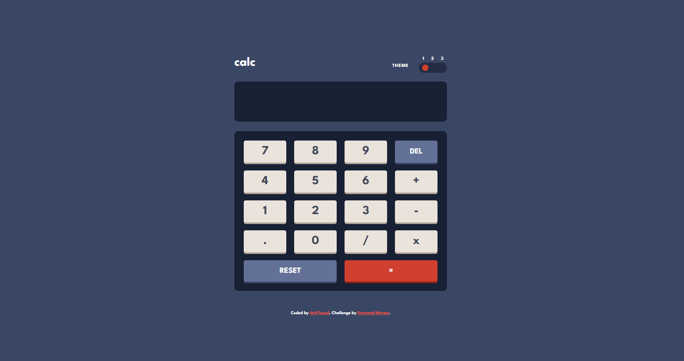

# Calculator App 

This is a calculator App with theme switcher. You can use either mouse or keyboard for providing input.

## Table of contents

- [Overview](#overview)
  - [Features](#features)
  - [Screenshot](#screenshot)
  - [Links](#links)
- [My process](#my-process)
  - [Built with](#built-with)
- [Author](#author)

## Overview

### Features

Users should be able to:

- See the size of the elements adjust based on their device's screen size
- Perform mathmatical operations like addition, subtraction, multiplication, and division
- Adjust the color theme based on their preference (theme switcher)
- Use keyboard or mouse for input
- On Keyboard, press "t" key for theme toggler, "enter" key for calculation, "space" key for reset, and other relevant keys as on the keyboard

### Screenshot

### Links

- Solution URL: [https://github.com/arifaisal123/frontend_projects/tree/main/frontend_challenges/calculator_app](https://github.com/arifaisal123/frontend_projects/tree/main/frontend_challenges/calculator_app)
- Live Site URL: [https://arifaisal123.github.io/frontend_projects/frontend_challenges/calculator_app/](https://arifaisal123.github.io/frontend_projects/frontend_challenges/calculator_app)

## My process

### Built with

- Semantic HTML5 markup
- CSS custom properties
- Flexbox
- CSS Grid
- Mobile-first workflow
- Bootstrap
- Vanilla JavaScript

## Author

- Website - [Arif Faisal](https://arifaisal123.github.io)
- Frontend Mentor - [@arifaisal123](https://www.frontendmentor.io/profile/arifaisal123)
- Twitter - [@faisalcodes123](https://www.twitter.com/faisalcodes123)
