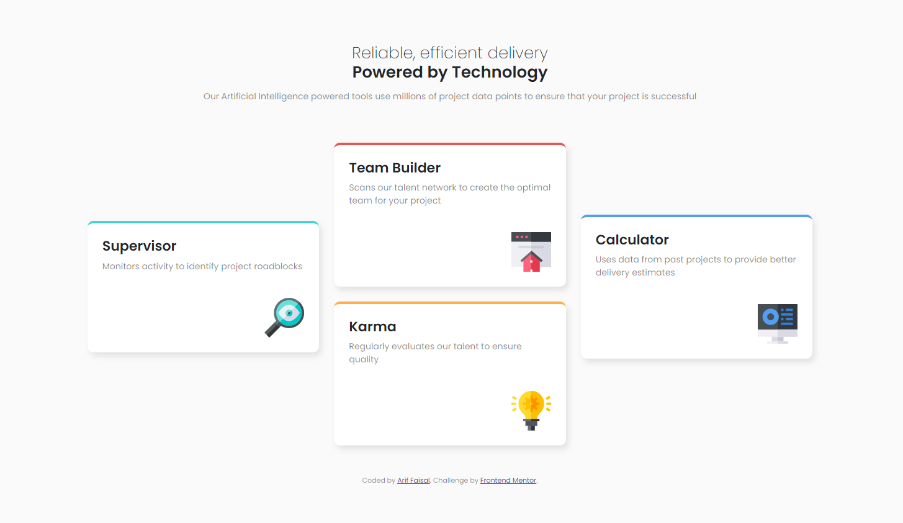

# Four Card Feature

This is a solution to the [Four card feature section challenge on Frontend Mentor](https://www.frontendmentor.io/challenges/four-card-feature-section-weK1eFYK). 

## Table of contents

- [Overview](#overview)
  - [The challenge](#the-challenge)
  - [Screenshot](#screenshot)
  - [Links](#links)
- [My process](#my-process)
  - [Built with](#built-with)
- [Author](#author)

## Overview

### The challenge

Users should be able to:

- View the optimal layout for the site depending on their device's screen size

### Screenshot

### Links

- Solution URL: [https://github.com/arifaisal123/frontend_projects/tree/main/frontend_challenges/four_card_feature](https://github.com/arifaisal123/frontend_projects/tree/main/frontend_challenges/four_card_feature)
- Live Site URL: [https://arifaisal123.github.io/frontend_projects/frontend_challenges/four_card_feature](https://arifaisal123.github.io/frontend_projects/frontend_challenges/four_card_feature)

## My process

### Built with

- Semantic HTML5 markup
- CSS custom properties
- Flexbox
- Bootstrap
- Mobile-first workflow

## Author

- Website - [Arif Faisal](https://arifaisal123.github.io/)
- Frontend Mentor - [@arifaisal123](https://www.frontendmentor.io/profile/arifaisal123)
- Twitter - [@faisalcodes123](https://twitter.com/faisalcodes123)
