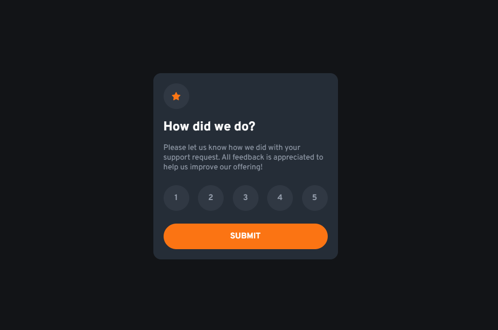

# Interactive Rating Component

This is a solution to the [Interactive rating component challenge on Frontend Mentor](https://www.frontendmentor.io/challenges/interactive-rating-component-koxpeBUmI).

## Table of contents

- [Overview](#overview)
  - [The challenge](#the-challenge)
  - [Screenshot](#screenshot)
  - [Links](#links)
- [My process](#my-process)
  - [Built with](#built-with)
- [Author](#author)

## Overview

### The challenge

Users should be able to:

- View the optimal layout for the app depending on their device's screen size
- See hover states for all interactive elements on the page
- Select and submit a number rating
- See the "Thank you" card state after submitting a rating

### Screenshot

### Links

- Solution URL: [https://github.com/arifaisal123/frontend_projects/tree/main/frontend_challenges/interactive_rating](https://github.com/arifaisal123/frontend_projects/tree/main/frontend_challenges/interactive_rating)
- Live Site URL: [https://arifaisal123.github.io/frontend_projects/frontend_challenges/interactive_rating](https://arifaisal123.github.io/frontend_projects/frontend_challenges/interactive_rating)

## My process

### Built with

- Semantic HTML5 markup
- SCSS/ Sass
- Flexbox
- JavaScript
- Mobile-first workflow

## Author

- Website - [Arif Faisal](https://arifaisal123.github.io)
- Frontend Mentor - [@arifaisal123](https://www.frontendmentor.io/profile/arifaisal123)
- Twitter - [@faisalcodes123](https://twitter.com/faisalcodes123)
